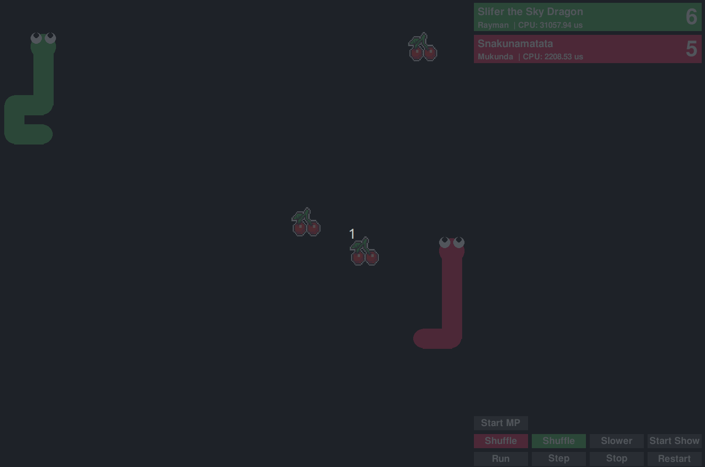

<!--
Copyright 2023 Nobleo Technology B.V.

SPDX-License-Identifier: Apache-2.0
-->

# Coding Challange: Multiplayer Snake [](https://github.com/nobleans-playground/coding-challenge-snakes/actions/workflows/python-app.yml)



## Tournament results

The finals played between Snakunamatata (Mukunda) and  Cherries are for Losers (Rinus).
The finals were won by Snakunamatata with 3 against 2, congratulations!

### Bonus prices

Longest snake achieved was won by FurryMuncher (Ferry) who achieved a length of 58!

Most wins by lines of code was won by Bite my shiny metal ass!
1. Bite my shiny metal ass: 8.2 (Jonothan)
2. Explorer: 5.8 (Daniel)
3. Apologetic Aphophis: 4.9 (Hein)

King of the hill was won by FurryMuncher!

### Qualification results

|                                   | Wins | Rate  | CPU    | CPU/t  | Matches | Turns/m | Elo    |
|-----------------------------------|------|-------|--------|--------|---------|---------|--------|
| There is no Candy! (disqualified) | 876  | 97.3% | 110.6  | 9.881  | 900     | 12.4    | 2252.0 |
| Snakunamatata                     | 687  | 76.3% | 950.2  | 7.239  | 900     | 145.8   | 1808.4 |
| Cherries are for Losers           | 615  | 68.3% | 1032.8 | 12.540 | 900     | 91.5    | 1717.0 |
| Serpent of the Light              | 587  | 65.2% | 582.3  | 6.719  | 900     | 96.3    | 1687.5 |
| Explorer                          | 437  | 48.6% | 175.9  | 0.484  | 900     | 403.5   | 1526.1 |
| FurryMuncher                      | 433  | 48.1% | 40.1   | 0.357  | 900     | 124.8   | 1510.8 |
| Bite my shiny metal ass           | 410  | 45.6% | 38.0   | 0.309  | 900     | 136.5   | 1483.0 |
| Apologetic Apophis                | 364  | 40.4% | 45.3   | 0.207  | 900     | 243.2   | 1434.5 |
| Random                            | 72   | 8.0%  | 42.3   | 0.304  | 900     | 154.5   | 819.1  |
| Wolverine                         | 66   | 7.3%  | 29.5   | 0.071  | 900     | 459.3   | 761.6  |

## Description

The goal is to beat all other bots playing snake.
Each match is 1v1, each bot will be paired up with all other opponents.
The bot with the most wins will win the tournament.

You should write your bot's logic in a Python class.
Each turn a function on your bot will be called with the state of the game and the bot needs to decide in which direction to move.

There are two example bots implemented

- [Random](./snakes/bots/random.py)
- [Simple Eater](https://github.com/nobleans-playground/coding-challenge-snakes-bot-template/blob/main/bot.py)

## How the bot interface works

Your bot will be initialized with an id and the size of the grid.
The grid is specified by the amount of tiles in x and y.

```py
def __init__(self, id: int, grid_size: Tuple[int, int]):
```

Each turn your bots `determine_next_move` function will be called.
As in input it'll receive the state of the game.
With this information you should calculate and return which direction it should move in.
After this function call, the move will be applied and then it's the turn of the other player.
If you move against a wall or another player, you are dead.

```py
def determine_next_move(self, snakes: List[Snake], candies: List[np.array]) -> Move:
```

How the bot implements this function is up to you.
You can train an AI, do some path planning or implement a method to trap opponents.

## Game rules

1. The exact rules of the game are implemented in [snakes/game.py](./snakes/game.py).
2. If you go out-of-bounds, collide with another bot or return anything other than a Move, your bot will die.
3. The amount of points you get is your longest achieved length.
4. The longest surviving bot will get double the points.
   This promotes eating candies, otherwise bots will stay short and hide in the corner.
5. There is a maximum turn limit of 10k turns (see [snakes/constants.py](./snakes/constants.py)).
   If there is no winner after these amount of turns have passed, the game is ended, both players survived the longest.

## Tournament rules

1. You are allowed to submit a maximum of two bots.
2. Your bot must be your own creation.
This rule is so that you may not blatantly copy someone's bot, change only a few lines, and then submit it as your own.
*Some* code duplication is of course inevitable and thus allowed, because the logic might be similar between bots.
3. The code of the game is law.
The rules of the game are implemented in the code.
If you want to know the specific rules of the game, please look at the code.
If the game determines you've won a game, that is the outcome.
4. Please limit the processing time of your bot.
Currently, there's a hard limit of `100ms` _average_ time-per-move as measured by [tournament.py](./tournament.py).
Please talk to one of the organizers if you think this is too short.
You can also use a profiler to try and make your code faster.
5. You can only use the Python libraries that are in the [requirements.txt](./requirements.txt) file.
If you want to use another library, please let one of the organizers know.
6. Multithreading is not allowed
7. Targeting a specific other bot is not allowed, although you may target the tactics of a general class of bot.
This means you are not allowed to use a bots ID to apply a specific strategy.
This also means is also not allowed to detect your other bot and 'suicide' when encountered.
8. You are not allowed to read or alter the game's internal state, or the state of the other bot.
You can only use the information that is given via the interface.

## How to submit a bot

Your bot will live as a git submodule inside the main challenge repository.
This means you will need to create your own GitHub account and create a new repository based on a template.
You can follow the following steps to create your own bot.

**Note**: You are allowed to submit a maximum of two bots.

1. Create a GitHub account if you don't have one already.
   Using a personal account is fine.
2. Create a personal repository where your bot will live.
   You can use the following repository template to do this for you: https://github.com/nobleans-playground/coding-challenge-snakes-bot-template
3. Give your bot a custom name and add your name as contributor
   Notify an organizer @Rayman or @heinwessels to add your bot to the challenge as a submodule in the main repository.
   Note: Your bot doesn't have to be complete to be added, it simply needs to run and return a valid move.
   You can update/change/refactor your bot at any point during the challenge.

## Running the bots on your machine

1. Clone this repository using `git clone --recursive git@github.com:nobleans-playground/coding-challenge-snakes.git`.
   The `--recursive` is to pull in all submodule bots.
2. Install all the dependencies
   - **On linux** `sudo apt install -y python3-more-itertools python3-numpy python3-pandas python3-pygame python3-scipy`
   - **On Windows** `pip install -r requirements.txt`
3. Run `tournament.py` or any of the other executables

## Bot development

- If you bot has **NOT** being added to the main repository, create a file in the [./snakes/bots](./snakes/bots) folder.
  Don't forget to add it to the bots list in [./snakes/bots/__init__.py](./snakes/bots/__init__.py).
  See [./snakes/bots/random.py](./snakes/bots/random.py) Random for inspiration
- If you bot has been added to the main repository, just edit the files in your own bots folder.

### Updating your local repository with the newest changes

Over the course of the challenge your local repository might be out-of-date with all the other bots.
To update the environent you can run the following two commands from the root folder.****

```sh
# Pull the latest game-code
git pull
# Pull the latest code from all the bots
git submodule update --remote
```

### Description of all the executables

- **commandline.py**:
  Battle 2 snakes against each other in the commandline.
- **tournament.py**:
  Battle all bots against eachother in a tournament. It'll write the results to a csv file.
- **gui.py**:
  Battle bots against eachother in a graphical user interface. In VSCode, press `F5` to run in debug mode. Use the following command to always have your bot as player 1, battling against a random bot. 

  ```python gui.py --snake1 your-bot-name``` 
- **elo.py**:
  From the tournament results csv you can calculate your bots elo rating.
